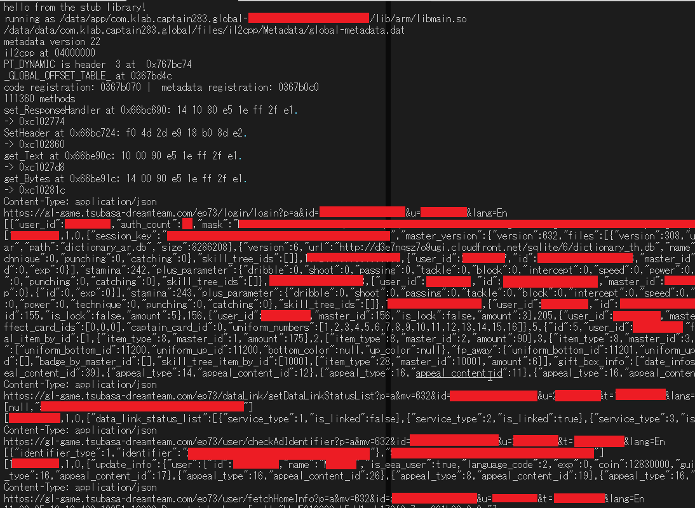

logs captain tsubasa dream team HTTP traffic through a stub library.



architecture is arm32 only

addresses are dynamically scanned through unity metadata. as long as the
binary doesn't change radically it should update itself. tested on the EN
aka global version of the game

msgpak requests are not handled. not sure what happens when they get logged

# building (linux)
download the latest android ndk standalone and extract it somewhere

set CC to your ndk location like so and run build.sh

```sh
export CC=~/android-ndk-r20/toolchains/llvm/prebuilt/linux-x86_64/bin/armv7a-linux-androideabi21-clang
./build.sh
```

# usage
have a rooted device with magisk hide enabled for the game. connect over
adb, or just ssh into it

replace the original library

```sh
adb root
adb push libmain.so /data/app/
adb shell

cd /data/app/com.klab.captain283.global-*/lib/arm/
mv libmain.so{,.bak}
mv /data/app/libmain.so .
chmod 755 libmain.so
chown system:system libmain.so
exit
```

clear logcat and start logging

```sh
adb shell logcat -c
adb shell logcat | grep --line-buffered captainhook
```

now start the game and watch the log. I usually pipe the above command into
a file, like
`adb shell logcat -d | grep --line-buffered captainhook > log.txt`
so you can read it in your favorite editor

if it fails to open global-metadata.dat, you might need to change
permissions on the directory it's located at. for example to make it work
on bluestacks I had to do `chmod -R 777 /data/media` as root.

my personal setup is a bit different, I host the binary on a local http
server and then adb shell over lan into my android machine, and wget it
as root:

```sh
adb shell
su
logcat -c
cd /data/app/com.klab.captain283.global-*/lib/arm
wget -O libmain.so 192.168.1.2:8080
chmod 755 libmain.so
chown system:system libmain.so
am force-stop com.klab.captain283.global
am start com.klab.captain283.global/com.klab.jackpot.notification.FirebaseMessagingUnsafeActivity
logcat | grep --line-buffered captainhook
```
